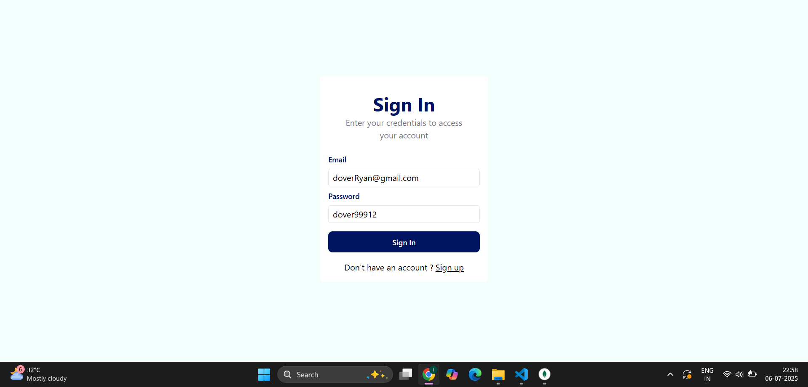
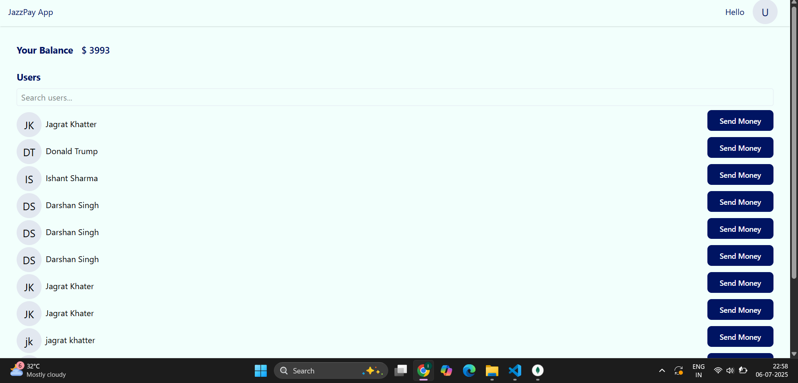
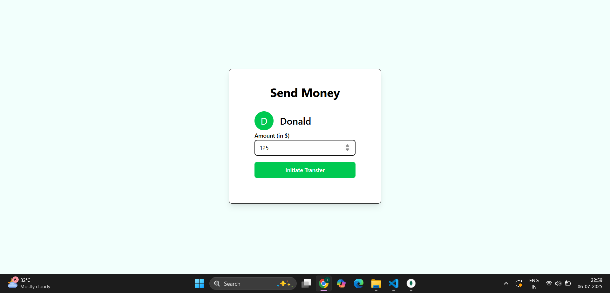

# 💸 Simple Paytm Application (MERN Stack)

A simplified full-stack Paytm-like money transfer app built using **MongoDB**, **Express**, **React**, and **Node.js**. It supports user authentication, balance checks, and money transfers with secure **MongoDB transactions**.

---

## 📁 Project Structure

```bash
Simple-Paytm-Application/
├── Backend/
│   ├── index.js                # Server entry point
│   ├── config/
│   │   └── db.js               # MongoDB schema and connection
│   ├── models/
│   │   ├── User.js             # User schema
│   │   └── Account.js          # Account schema
│   ├── routes/
│   │   ├── user.js             # Signup, signin, user info
│   │   └── account.js          # Balance and transfer logic
│   ├── middlewares/
│   │   └── middleware.js       # JWT auth middleware
│   └── config.js               # Secret keys and DB URI
│
├── frontend/
│   ├── index.html              # Root HTML
│   ├── src/
│   │   ├── main.jsx            # React entry point
│   │   ├── App.jsx             # React Router setup
│   │   ├── index.css           # Tailwind + custom theme
│   │   ├── pages/
│   │   │   ├── Signup.jsx
│   │   │   ├── Signin.jsx
│   │   │   ├── Dashboard.jsx
│   │   │   └── SendMoney.jsx
│   │   └── components/
│   │       ├── Heading.jsx
│   │       ├── Subheading.jsx
│   │       ├── InputBox.jsx
│   │       ├── Button.jsx
│   │       ├── BottomWarning.jsx
│   │       ├── Appbar.jsx
│   │       ├── Balance.jsx
│   │       └── Users.jsx
└── README.md
```

---

## ⚙️ Features

### 🔐 Authentication

- Sign Up & Sign In with JWT-based authentication.
- Password & email validation using **Zod**.
- Secure middleware-protected routes.

### 🏦 Account Management

- Automatically creates a user account with a random initial balance.
- View your current balance.
- Real-time list and search of other users.

### 💸 Money Transfer

- Send money to other users.
- Uses **MongoDB transactions** for reliable, atomic fund transfers.
- Rollback support if anything fails.

---

## 📦 Technologies Used

### 🔧 Backend

- **Node.js** & **Express.js**
- **MongoDB** + **Mongoose**
- **JWT** (JSON Web Tokens)
- **Zod** for schema validation
- Middleware for authentication

### 🎨 Frontend

- **React.js**
- **Tailwind CSS** (with custom theme)
- **Axios** for API requests
- **React Router DOM**

---

## 🚀 Getting Started

### 1️⃣ Clone the repository

```bash
git clone https://github.com/your-username/Simple-Paytm-Application.git
cd Simple-Paytm-Application
```

---

### 2️⃣ Setup Backend

```bash
cd Backend
npm install
```

Edit the `config.js` file with your own MongoDB connection string and JWT secret:

```js
// config.js
const JWT_SECRET = 'your-secret-key';
const db_string = 'your-mongodb-uri';
module.exports = { JWT_SECRET, db_string };
```

Run the backend server:

```bash
node index.js
# or use nodemon
```

Server runs at: `http://localhost:3000`

---

### 3️⃣ Setup Frontend

```bash
cd ../frontend
npm install
npm run dev
```

Frontend runs at: `http://localhost:5173`

---

## 🛡️ API Endpoints

### 👤 User Routes

| Method | Endpoint               | Description             |
|--------|------------------------|-------------------------|
| POST   | `/api/v1/user/signup`  | Create new user         |
| POST   | `/api/v1/user/signin`  | Login and get JWT token |
| PUT    | `/api/v1/user/`        | Update user info        |
| GET    | `/api/v1/user/bulk`    | Search/filter users     |

---

### 💰 Account Routes

| Method | Endpoint                    | Description             |
|--------|-----------------------------|-------------------------|
| GET    | `/api/v1/account/balance`   | Get user's balance      |
| POST   | `/api/v1/account/transfer`  | Transfer money          |

> ⚠️ All protected routes require a valid JWT in the `Authorization` header (format: `Bearer <token>`).

---

## 🧪 Example Transaction Flow

1. User signs in and receives a JWT token.
2. User views dashboard with balance and a list of other users.
3. User selects a recipient and enters an amount to send.
4. System validates balance and performs a transaction using a **MongoDB session**.
5. On success, balances are updated atomically and a confirmation is shown. ✅

---

## 📸 Screenshots

### 🔐 Sign Up


### 🔐 Sign In


### 🏦 Dashboard


### 💸 Send Money


---

## 📃 License

MIT License

---

## 👨‍💻 Author

Developed by **Jagrat Khatter**.

If you found this helpful, consider ⭐️ starring the repo and contributing!

---
